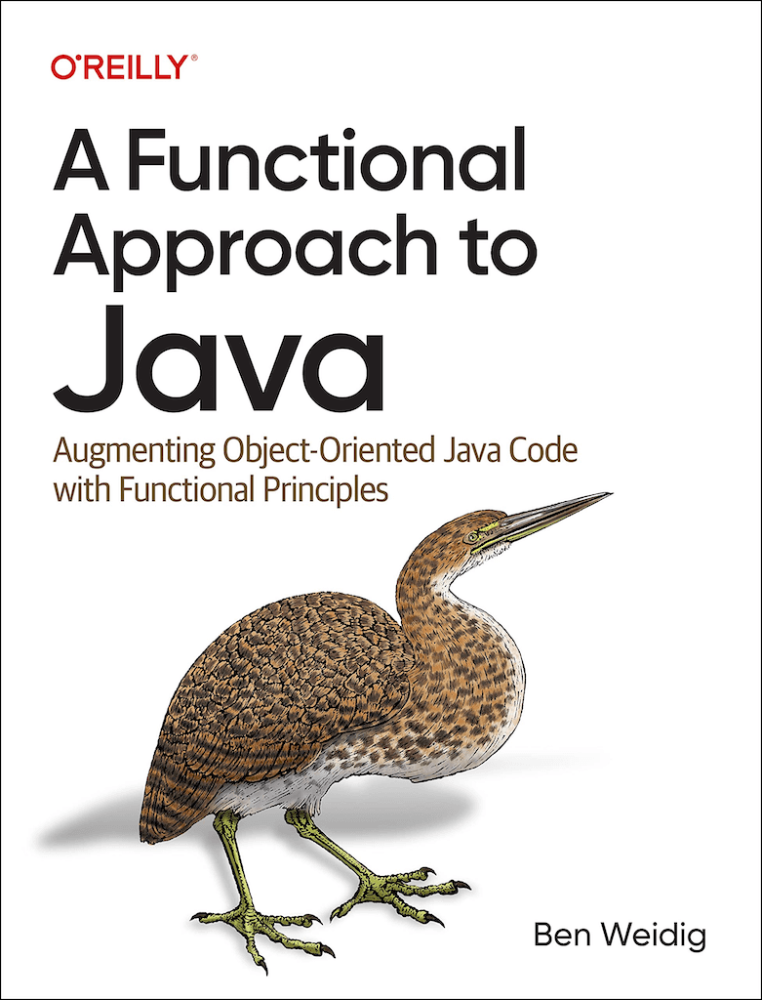

# A Functional Approach to Java

This is the accompanying repository for the O'Reilly book [A Functional Approach to Java](https://www.oreilly.com/library/view/a-functional-approach/9781098109912/).

## How To Use

The code and files are split into three categories:

* JShell
* Java
* Other

The actual implementation of the examples might differ from their counterparts in the book to make them easier to use or runnable.

### JShell

The examples from the book can mostly be run directly in [JShell](https://belief-driven-design.com/jshell-the-java-repl-82d804e6cbf/) by either running `jshell` and pasting the code into it or using a redirect, e.g., `jshell < file.java` instead.

Some code, however, demonstrates invalid code, and either throws Exceptions or won't compile at all.

Even though most of the `import` statements aren't required, they are still there to ensure everything works, regardless of your JShell configuration, or if you want to use the code in your favorite IDE.

### Java

There are two types of examples in the folder `java`.
Runnable examples often wrap multiple types into a singular class with a `public static void main` method to run the actual code.
Other files are representations of certain designs and as such not runnable on their own.

Since Java 11, you don't need to compile the file beforehand, e.g., `javac ExampleFile.java` and then `java ExampleFile`.
Instead, `java ExampleFile.java` compiles and runs it in a single step.

### Other Files

The `other` examples are mostly non-Java languages and partial Java code that's non-runnable or incomplete.

[Chapter 14](./part-2/14-design-patterns/) is an exception, as it's a Gradle-project with dedicated tasks for each example.
See its [`README.md`](./part-2/14-design-patterns/README.md) for more info.

## Buying the book

Besides using the [O'Reilly Learning Platform](https://www.oreilly.com/library/view/a-functional-approach/9781098109912/), you can buy a paperback version of the book at your favorite store.
Here are a few direct links to US stores:

* [Amazon](https://www.amazon.com/-/de/dp/1098109929)
* [Barnes & Noble](https://www.barnesandnoble.com/w/a-functional-approach-to-java-ben-weidig/1141565109?ean=9781098109929)
* [Books Inc](https://www.booksinc.net/book/9781098109929)
* [Powell's Books](https://www.powells.com/book/functional-approach-to-java-augmenting-object-oriented-java-code-with-functional-principles-9781098109929)

ISBN-10: 1098109929  
ISBN-13: 9781098109929
